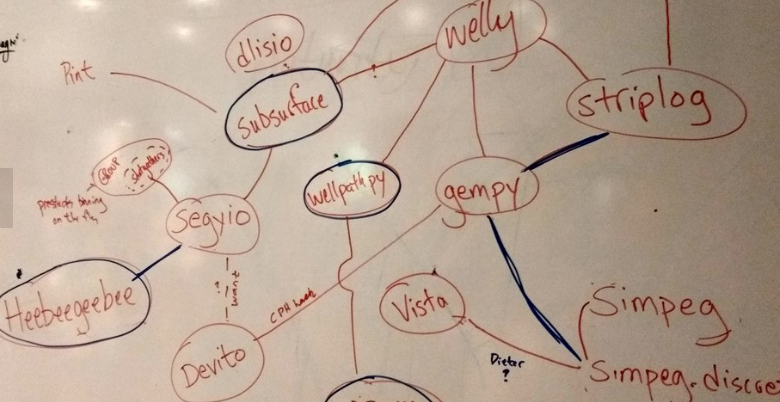
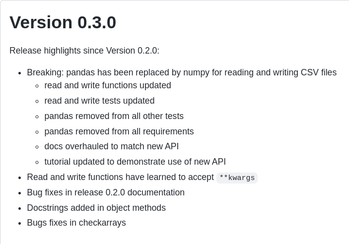

# Hacker to Maintainer

Or how and why to make some [cheese](https://wiki.python.org/moin/CheeseShop)?

Note: In this conversation, I'll show you how a "domain expert" can work with a "Software engineer" to tackle a recurring problem and automate a solution. I'll talk about **geology** and **drilling**, but you can equally well think **statistics** and **visualization**, or **business use case** and **data engineering pipeline**

---

## [How do you describe the indescribable?](https://agilescientific.com/blog/2019/5/18/transform-happened)

Note: (1) Do you all know what a hackathon is? (2) This is the time and place where this idea germed; while the topic here is subsurface science, it could be anything, and while **mapping out the workflow**, I noticed a gap that needed filling by missing **functionality**.

---

## Why a new library?

We could have:
1. Written a script or notebook
2. Added to [welly](https://code.agilescientific.com/welly/)
3. Start a new [pypi project](https://pypi.org/project/wellpathpy/)

Note: There are several things to consider: (1) Writing a script or notebook is
fine locally but does not solve the problem **for all users**, (2) adding to an
existing library is **non-trivial** and you then **depend on the maintainers
good will** and any future **breaking code**, (3) in the unix philosopy, as in
functional programming, it is good practise to have **pure functions** (i.e.
functions that (1) return identical values for identical inputs and (2) have no
side-effects) and programs that perform only **one task**

---

## Getting started

- Use cases
- Conventions
- Limits

Note: (1) We kept a strong focus on the functionality we wanted: [Imports, Loading_data, Loading_headers, Transforms, Conventions, Exports], (2) We rejected out-of-scope demands (anti-collision -> multiple wells)

---

## `DE ∪ SE`

where:
- `DE` is Domain expert, and
- `SE` is Software engineer

Note: In the subsurface as in any domain, **data scientists** are better when they collaborate with `DE`'s and `SE`'s alike, we are more together than apart.

---

## TDD vs DDD

- [test_calculations.py](https://github.com/Zabamund/wellpathpy/blob/master/wellpathpy/test/test_calculations.py)

- [readthedocs](https://wellpathpy.readthedocs.io/en/latest/tutorial.html#wellpathpy-tutorial)

- [raw rst file](https://raw.githubusercontent.com/Zabamund/wellpathpy/master/docs/source/tutorial.rst)

Note: **Time to see some code!!** We chose to develop this project following both TDD and DDD, see for example [test_calculations.py](https://github.com/Zabamund/wellpathpy/blob/master/wellpathpy/test/test_calculations.py) and the **tutorial** page on readthedocs. Remember that `untested code is broken code!`

---

## Limiting our dependencies

Note: Early on it was clear that we did not want too many dependencies, **reducing their number reduces our exposure to upstream breaking changes**, and as we used `numpy` anyway it was a simple fix to use more of it.

----

### OOP vs functional

[wellpathpy's position log](https://github.com/Zabamund/wellpathpy/blob/master/wellpathpy/position_log.py) now written with Classes (OOP) but started out in a purely functional style

Note: This was not initially the case, and the details of these architectural choices rely entirely on the Software Engineer

---

## Finished product?

So we now have:

1. [github](https://github.com/Zabamund/wellpathpy/)
2. [pypi](https://pypi.org/project/wellpathpy/)
3. [readthedocs](https://wellpathpy.readthedocs.io/en/latest/)
4. [CI/CD - github actions](https://github.com/Zabamund/wellpathpy/tree/master/.github/workflows)

So: **are we finished?**

Note: Ask the students, hopefully lead to next slide about issues and bugfixes

---

## So now you're a maintainer

- [github *closed* issues](https://github.com/Zabamund/wellpathpy/issues?q=is%3Aissue+is%3Aclosed)

- [github *open* issues](https://github.com/Zabamund/wellpathpy/issues?q=is%3Aopen+is%3Aissue)

Note: The work never stops, but now more people are finding bugs, suggesting patches, improving the code.

----

## Make your own package

- [setuptools/setup.py](https://setuptools.pypa.io/en/latest/userguide/quickstart.html)
- [PEP 517](https://peps.python.org/pep-0517/)
- [snowfake - an example PEP 517 package](https://github.com/agilescientific/snowfake)

Note: We used the traditional `setuptools` way of packaging using a `setup()` function within a `setup.py` script in `wellpathpy`. `snowfake` is an example repo and package that uses the new `PEP 517` approach.

---

## Thank you!
